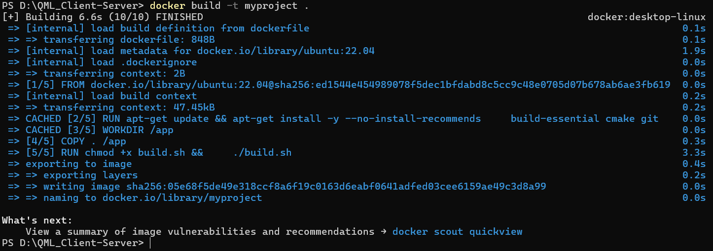

# QML_Client-Server

This project demonstrates a multi-component application built for Unix-like systems (Linux, WSL, or macOS). It includes:

- A simple web server that serves QML files.
- A C++ Qt application that fetches and displays a QML UI.
- A QML file defining a user interface.
- A build system to ensure everything works together.

> **Note:**  
> This project was primarily developed on Windows and tested on WSL (Windows Subsystem for Linux) and native Linux distributions. Cleanup functionality for native Windows does not work correctly, but all features function as expected on WSL. The project has not been tested on macOS.
---
## Table of Contents

- [Overview](#overview)
- [Build Instructions](#build-instructions)
- [Testing](#testing)
- [Docker](#docker)
- [Demo](#demo)
- [Additional Info](#additional-info)
- [License](#license)

---

## Overview

The project consists of a simple web server, a C++ Qt application, and a QML user interface that work together as follows:

1. **Simple Web Server:**  
   - Listens on a random port between 10000 and 20000.
   - Provides an endpoint `/api/v1/getQML` that accepts a POST request with a JSON payload containing a QML filename.
   - Reads and returns the content of the requested QML file.

2. **C++ Qt Application:**  
   - Calls the Simple Web Server to fetch the QML file.
   - Uses a `QQuickView` to display the QML UI.
   - Implements an elapsed timer with a Start/Stop button, displays the elapsed time in a readonly text field, lists USB devices, and provides Exit and Cleanup functionalities.

3. **QML File:**  
   The QML file (fetched from the server) includes:
   - **Start/Stop Button:** Toggles the timer and changes text accordingly.
   - **Readonly Text Field:** Displays the elapsed time.
   - **List USB Devices Button:** Displays attached USB devices (model, vendor, location).
   - **Exit Button:** Shuts down the C++ application and the web server.
   - **Cleanup Button:** Shuts down and deletes both the web server and the C++ application completely.

4. **Build System and Documentation:**  
   - A set of scripts (`build.sh`, `dependencies.sh`) automate building all components.
   - Documentation is provided so an uneducated user can build and run the system by following clear instructions.

---

## Build Instructions
1. Clone the Repository
```bash
git clone https://github.com/hiteshcmonga/QML_Client-Server.git
cd QML_Client-Server
```
2. Install Dependencies
```bash
chmod +x dependencies.sh
./dependencies.sh
```
3. Build the Project
```bash
chmod +x build.sh
./build.sh
```
4. Run the application
```bash
cd build
./Application
```

## Testing
Unit tests are not included at this time, as the current scope is intentionally minimal. Additional unit tests 
can be introduced.
However, the repository structure supports easy integration of testing frameworks (GoogleTest, QtTest, pytest).

## Docker
A Dockerfile is provided to verify that the project builds correctly in a clean Ubuntu environment. 
This Docker setup is purely to confirm dependency correctness, not for deployment.


## Demo

### WSL (Recommended for Linux-based environments)
The following GIF demonstrates the complete set of features when running the application using WSL (Windows Subsystem for Linux) or native Linux distributions. This includes:
- Starting and stopping the timer.
- Displaying elapsed timer values.
- Listing USB devices connected.
- Properly exiting the application.
- Fully functional server shutdown and self-cleanup capabilities, leaving no residual files.


### Native Windows (Experimental)


The following GIF demonstrates basic application functionality when running natively on Windows:

- Starting and stopping the timer.
- Displaying elapsed timer values.
- Listing USB devices connected to your system.
- Basic exit functionality.
Note: The cleanup feature does not function on native Windows environments and is considered experimental.


## Additional Info
### Environment Variables for Qt (if using official Qt installer)
```bash
export Qt6_DIR="/home/<your_username>/Qt/6.8.2/gcc_64/lib/cmake/Qt6"
export CMAKE_PREFIX_PATH="$Qt6_DIR:$CMAKE_PREFIX_PATH"
export QT_PLUGIN_PATH="/home/<your_username>/Qt/6.8.2/gcc_64/plugins
```